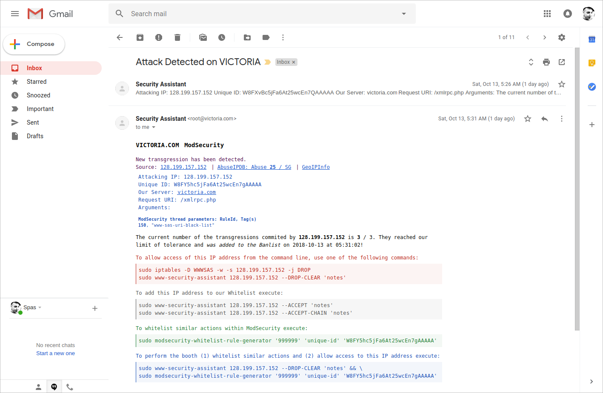

# WWW Security Assistant

This is a bundle of scripts that can helps you with malicious IP addresses handling within Apache2 and Ubuntu environment.
The core of the bundle was inspired by a [question](https://askubuntu.com/a/922144/566421) on AskUbuntu.com.

The current project covers the following topics, that are involved into a complete mechanism. It is all about **How to increase Apache2 security within Ubuntu 20.04**.

1. [**WWW Security Assistant** (WWWSAS) > Iptables | E-mail](#www-security-assistant--iptables--email)
2. [**WWW Security Assistant** Installation and Setup *](#installation-and-setup-of-www-security-assistant)
3. [**Iptables** Basic Configuration: Save and Restore](#iptables--basic-configuration--save-and-restore)
4. [*What is included in the repository about **Iptables**?*](#what-is-included-in-the-repository-about-iptables)
5. [**ModEvasive** for Apache2](#modevasive-for-apache2)
6. [ModEvasive > WWWSAS > Iptables](#modevasive--wwwsas--iptables)
7. [*What is included in the repository about **ModEvasive**?*](#what-is-included-in-the-repository-about-modevasive)
8. [**ModSecurity 2.9** for Apache2](#modsecurity-29-for-apache2)
9. [ModSecurity Core Rule Set 3.x](#modsecurity-core-rule-set-3x)
10. [ModSecurity Setup GeoIP (GeoLookup) Data base](#modsecurity-setup-geoip-for-geolookup-data-base)
11. [ModSecurity Rules Whitelisting](#modsecurity-rules-whitelisting)
12. [ModSecurity Rules > WWWSAS > Iptables](#modsecurity-rules--wwwsas--iptables)
13. [ModSecurity and Apache Log Files](#modsecurity-and-apache-log-files)
14. [ModSecurity Log Files > Fail2Ban > Iptables](#modsecurity-log-files--fail2ban--iptables)
15. [ModSecurity GuardianLog > HTTPD Guardian > WWWSAS > Iptables](#modsecguardianlog--httpd-guardian--wwwsas--iptables)
16. [ModSecurity GuardianLog > HTTPD Custom Analyze > WWWSAS > Iptables](#modsecguardianlog--httpd-custom-analyze--wwwsas--iptables)
17. [*What is included in the repository about **ModSecurity 2.9**?*](#what-is-included-in-the-repository-about-modsecurity)
18. [WWWSAS **MSWLRG** (ModSecurity Whitelist Rules Generator)](#wwwsas-modsecurity-whitelist-rules-generator)
19. [WWWSAS **Flood Detector** > WWWSAS > Iptables](#wwwsas-flood-detector--wwwsas--iptables)
20. [WWWSAS **Post Analyse** > WWWSAS > Iptables](#wwwsas-post-analyse--wwwsas--iptables)
21. [WWWSAS **AbuseIPDB Integration** > WWWSAS > Iptables](#wwwsas-abuseipdb-integration--wwwsas--iptables)
22. [HTTPS and Common Apache Security Tips](#https-and-common-apache-security-tips)
23. [Credits](#Credits)


## WWW Security Assistant > Iptables | Email

Here is presented the script [**`wwwsas.sh`**][2]. It could help you with the handling of the malicious IP addresses. The script has two modes.

### Automatic mode

When an external program, as Apache's `mod_security`, provides a malicious `$IP` address. In this case, the syntax that invokes the script, should be:

  ````bash
  wwwsas.sh "$IP" ModSecurity '$NOTES'
  wwwsas.sh "$IP" FloodDetector '$NOTES'
  wwwsas.sh "$IP" PostAnalyse 'Number of the additional attacks'
  wwwsas.sh "$IP" ModEvasive # Semi depricated
  wwwsas.sh "$IP" a2Analyst  # Semi depricated
  wwwsas.sh "$IP" Guardian   # Semi depricated
  ````

In this mode the script provides **two action stages** and for every action it will **send an email** to the administrator(s).

* First stage: for the first few **'transgressions'** the source `$IP` will be **banned for a period of time** equal to the value of `$BAN_TIME`. This mode uses the command `at`.

* Second stage: when the number of the transgressions from certain `$IP` becomes equal to the value of `$LIMIT`, this `$IP` address will be **banned permanently** through Iptables and will be added to the `$WWW_SAS_BAN_LIST`.

The script have a kind of integration with [`www.abuseipdb.com`](https://www.abuseipdb.com). Via the satellite script [`modules/abuseipdb-push-pull.sh`](#wwwsas-abuseipdb-integration--wwwsas--iptables), the main script can pull and push data from their API. 
The necessary information about these actions will be provided within the emails sent by the main script. If you want to use this feature, you should register on [`www.abuseipdb.com`](https://www.abuseipdb.com) and provide your API key within the configuration file - variable `$AbuseIPDB_APIKEY`. For more information read the [relevant section](#wwwsas-abuseipdb-integration--wwwsas--iptables) below.

Via the sattelite script [`is-crawler-ip.sh`](modules/is-crawler-ip.sh), the main script, `wwwsas.sh`, will test whether the provided `$IP` address is a *crawler* - if *true* (by default) the script will not block the `$IP` but will send email to the administrator.

The script is able to send two kinds of emails depending on your preferences provided within the configuration file. It can send HTML formated emails and plain text emails - variables `$EMAIL_TO` and `$EMAIL_TO_PLAIN`. If none of these variables is set, the script execution will be discontinued (interrupted) before the email section.

Here is how one HTML formated email looks like:



Another cool feature is the embedded [Whitelist Rule Generator for ModSecurity](#whitelist-rule-generator--modsecurity-rules-whitelisting).

### Manual mode

This mode accept the following options:

* `wwwsas.sh <ip-address>` **`--DROP "log notes"`**

    Creates an entry into the file `/etc/wwwsas/logs/black-list.log` and generates a rule as:

      iptables -A WWWSAS -s $IP -j DROP

* `wwwsas.sh <ip-address>` **`--CLEAR "log notes"`**

    Creates an entry into the file `/etc/wwwsas/logs/clear-list.log`, remove the certain Iptables rule, removes the `$IP` from the history and from the `$WWW_SAS_BAN_LIST`:

      iptables -D WWWSAS -s $IP -j DROP

* `wwwsas.sh <ip-address>` **`--ACCEPT "log notes"`**

  Creates entries in:
  * `/etc/wwwsas/logs/white-list.log`,
  * `/etc/modsecurity/wwwsas-rules.conf`,
  * `/etc/wwwsas/confs/modsec.ip.white-list.conf` and
  * `/etc/apache2/mods-available/evasive.conf`.


* `wwwsas.sh <ip-address>` **`--ACCEPT-CHAIN "log notes"`** (this option is not recommended)

  The same as the above plus a rule as: `iptables -A WWWSAS -s $IP -j ACCEPT`.

* `wwwsas.sh <ip-address>` **`--ACCEPT-REMOVE "log notes"`**

  Reverts the changes made by any of the ACCEPT commands.

### Manual mode WEB commands

*Read [assets/web-commands/README.md](assets/web-commands/README.md) for more information.*

### Dependencies

* All configuration variables are placed in the commonly used file `wwwsas.conf`.
* The script uses [`iptables-save.sh`](firewall/iptables-save.sh) and the `iptables` chain `WWWSAS`, explained in the [next section](#iptables--basic-configuration--save-and-restore). It will create and maintain few files within the `$WORK_DIR`:

  * `logs/history.log` - contains the data for the previous IP addresses transgressions.
  * `tmp/wwwsas.mail` (`.plain`) - the content of the last email sent by the script.
  * `logs/white-list.log`; `.black.list` and `.clear.list`. Also several other files will be created by the script and the other scripts included in the repository.

* The script needs a minimal configuration to send emails:

    ````bash
    sudo apt install mutt postfix # (alternatives) s-nail mailutils
    sudo dpkg-reconfigure postfix  # For General type: Internet Site
    echo 'Test passed.' | mail -s Test-Email email@example.com
    ````

  If there is any configured HTTPS service its [TLS certificate can be used within the Postfix service][5]. Also see [this](https://askubuntu.com/a/732782/566421) and [this](https://askubuntu.com/q/1031366/566421) Q&Ahow to use `/.mailrc`.

* `sudo apt install at` - see [`man at`][6].
* `sudo apt install jq` - json parse tool.

### References

* [**The source of the main idea of this script**][7] | [Simple Denial of Service][8]
* [send email, the minimal required configuration][4].
* [How do I set Cron to send emails?](https://askubuntu.com/a/1021086/566421))

## Installation and SETUP of WWW Security Assistant

There are three main steps. The second step is used also when you need to update your local copy.

### Step 1 :: Clone the repository

* *You will need git on this step, so if it is not installed just execute: `sudo apt install git`.*

The first step is to clone the repository. The default `$WORK_DIR` coded in the script is `/etc/wwwsas`:

````bash
cd /etc
sudo git clone https://github.com/metalevel-tech/wwwsas.git
````

You can choose another name of the script's directory and another location, because during the setup process, the `SETUP` script will parse the current location and will apply the necessary changes:

````bash
sudo git clone https://github.com/metalevel-tech/wwwsas.git /etc/wwwsas
````

### Step 2 :: Setup WWW Security Assistant script bundle

Go inside the directory where you have cloned the repository and execute the `SETUP` script:

````bash
sudo ./SETUP
````

In addition the `SETUP` could handle two parameter:

````bash
sudo ./SETUP [branch] [no-ipset]
````

* `$1` - `branch` of `https://github.com/metalevel-tech/wwwsas` (default: master).

* `$2` - when the second positional parameter is set to `no-ipset` with this option the ipset setup from the last step will be disabled - for kernel < 2.6 (default: unset).

The `SETUP` will interactively guide you through the steps, described below, and will write a log file - `SETUP.log`, where you could obtain useful information later. For example ***if you want to remove*** WWW Security Assistant from your system, just read the log file and remove the deployed files.

* Initially the script will check the first level dependencies. Most of them should be installed with Ubuntu Server by default, probably only `colordiff` nad `jq` could be a missing dependency.

1. At this step the setup will ask you to **Confirm the installation (update) policies**, this is a reminder of that the repository will be pulled again (let's imagine this is update) and all of our changes made on the files, that are not listed in the `.gitignore` file, will be terminated. If you have done such changes, please, make a copy of the relevant files with a `.local` extension and they will be kept. After you are agree the repository will be pulled and the setup will proceed.

2. At this point the setup will **Check of the installer version** and if the newly pulled `SETUP` file has different version the process will be interrupted and you must start it again.

3. **Environment setup** - at this stage the setup script will try to parse the main configuration file `wwwsas.conf` and if it exists the setup will conclude this is an update and will use the existing configuration file. If `wwwsas.conf` doesn't exist you will be asked about few basic preferences, also you will be informed about the files that will be changed.

4. The next step is **Setup (Update)** of the **WWW Security Assistant Configuration**. Here the installation script will create local `.conf` files, based on the `.example` files. You will be informed about each file creation and will be asked to edit it.

   * Such `.conf` files will be created in the directories `/etc/wwwsas` and `/etc/wwwsas/conf`.
   * Edit at least **`wwwsas.conf`** and tweak the first priority section - change the value of the variable `$EMAIL_TO`, etc.

5. **Create shell commands**. The setup script will make symbolic links for few of our scripts to `/usr/local/bin` thus they be accessible as shell commands. Within the emails that will be sent by the main script, you will receive instructions how to use most of these commands. The created commands are:

   * `wwwsas` that is a symbolic link to [`wwwsas.sh`](wwwsas.sh),
   * `wwwsas-flood-detector` that is a symbolic link to [`modules/flood-detector.sh`](modules/flood-detector.sh),
   * `wwwsas-post-analyse` that is a symbolic link to [`modules/post-analyse.sh`](modules/post-analyse.sh),
   * `wwwsas-modsec-whitelist-rg` that is a symbolic link to [`modules/modsecurity-whitelist-rule-generator.sh`](modules/modsecurity-whitelist-rule-generator.sh),
   * `wwwsas-abuseipdb` that is a symbolic link to [`modules/abuseipdb-push-pull.sh`](modules/abuseipdb-push-pull.sh),
   * `wwwsas-is-crawler-ip` that is a symbolic link to [`modules/is-crawler-ip.sh`](modules/is-crawler-ip.sh),
   * `wwwsas-geoip-update` that is a symbolic link to [`modules/geoip-update.sh`](modules/geoip-update.sh),
   * `wwwsas-logrotate` that is a symbolic link to [`modules/logrotate.sh`](modules/logrotate.sh),
   * `wwwsas-iptables-save` that is a symbolic link to [`firewall/iptables-save.sh`](firewall/iptables-save.sh),
   * `wwwsas-iptables-restore` that is a symbolic link to [`firewall/iptables-restore.sh`](firewall/iptables-restore.sh),
   * `wwwsas-ipset-save` that is a symbolic link to [`firewall/ipset-save.sh`](firewall/ipset-save.sh),
   * `wwwsas-ipset-restore` that is a symbolic link to [`firewall/ipset-restore.sh`](firewall/ipset-restore.sh).

6. She script will **Create few empty \*.log, \*.list and \*.history files**. We need this step because, later, we must grant the necessary write permissions to the Apache's user *www-data*.

7. **Setup [wwwsas-crontab](assets/etc/cron.d/wwwsas-crontab.example).**

   Please review this file carefully! 
   
   The `@reboot` *cronjobs* will restore the `iptables` configuration and this may be dangerous if something is not correct.

   The *cronjob* for `flood-detector.sh` will be executed on each minute (see the relevant section about this script below). You can skip this step, but `flood-detector.sh` doesn't consume much server resources and, you will see, time-to-time it does nice work.

   The *cronjob* for `modules/post-analyse.sh` will be executed on each hour.

8. **Install the necessary Apache2 modules**. If this is an update this step will be skipped. Otherwise to install and enable the Apache's modules `headers`, `rewrite`, `expires`, <s>`evasive`</s>, `security2`. Actually we need the module `security2`, thath will call our script `wwwsas.sh` from the Apache's environment. The other are dependencies.

   The module `evasive` will be installed and configured but will be **disabled**, because `modSecurity2` covers its functionality in a better way by the CRS (see the next section) rules `900700` and `900260`. Here is an explanation: [Apache2 mod_evasive vs mod_security with OWASP crs when protecting against DDOS?](https://stackoverflow.com/a/66196947/6543935)

   The reposittory `modsecurity-crs` will be installed as dependency of `modSecurity2`, but we will install a newer version later, so this package will be removed.

9. **Install ModSecurity Core Rule Set 3.x, GeoLite2**. The `SETUP` script will clone the latest stable version of ModSecurity CoreRuleSet, in the directory defined in Step 3 - currently this is [`v3.3/master`][32]. If this is an update this step will be skipped.

10. **Setup Apache**. The setup will try to (re)create the default Apache's log directory (just in case). Next the setup will change the ownership of the file `execution.log` to `www-data`, thus it will be able to write execution logs. Then it will ask to:

    * Create a file within `/etc/sudoers.d/` with purpose to allow to `www-data` to execute our script 'wwwsas.sh' by `sudo` without password. This is a little bit dangerous step, so you will be asked to open and save this new file by the command [`visudo`][8] to confirm there is not a problem!

    * <s>Create or update preset basic templates for (1) `apache2.conf` (note: first will be created `apache2.conf.template` and then it will be compared with your existing `.conf` file), (2) `sites-available/wordpress.conf.template` and (3) `sites-available/mediawiki.conf.template`. If you want, you could use them within your configuration further.</s>

11. **Setup ModEvasive**. Here you must replace the existing `apache2/mods-available/evasive.conf` file with the new one that involve our main script to ModEvasive's setup. The setup will (re)create the ModEvasive's log directory, chosen before.

12. **Setup ModSecurity**. The setup will (re)create the ModSecurity's log directory, chosen before.

    If this is a new installation, the setup will create default `.conf` files from the examples, that comes with the relevant installation packages. These files are:

    * `/etc/modsecurity/modsecurity.conf`
    * `/etc/modsecurity/coreruleset/crs-setup.conf`
    * `/etc/modsecurity/coreruleset/rules/REQUEST-900-EXCLUSION-RULES-BEFORE-CRS.conf`
    * `/etc/modsecurity/coreruleset/rules/RESPONSE-999-EXCLUSION-RULES-AFTER-CRS.conf`

    After that these files will be compared with the `.example` files that comes with our repository (`www-security-assistant`) under the directory `assets/`. If this is an update only this step will be performed.

    Here you must replace the existing `.conf` files with the new ones that involve our main script to ModSecurity's setup. Or you must edit these files in a appropriate way. The installation script will update also the file `apache2/mods-available/security.2.conf` that involves the above configuration files within the Apache's configuration.

    Further the installer will setup `logrotate` entry for the ModSecurity logs and also `crontab` for the GeoIP DB update script ow OWASP ModSec CRS. Finally the file `assets/www/wwwsas.issues.ph` will be created (it is local and you can edit it as you wish), and it will be sym-linked to each first level sub directory in `/var/www` where ModSecurity will redirect the bad guys.

13. **Iptables minimal configuration**. At this stage the rules listed below will be applied. For one step further advanced configuration you can check and apply the file `iptables.basic-setup.local`.

    ````bash
    iptables -N WWWSAS              # Create the chain where wwwsas.sh will push rhe bad gays
    iptables -A INPUT -j WWWSAS     # Attach the new chain to the default INPUT chain
    iptables -I INPUT 1 -i lo -p all -j ACCEPT                                  # Accept the loopback input
    iptables -I INPUT 2 -m conntrack --ctstate ESTABLISHED,RELATED -j ACCEPT    # Allow 3 way handshake
    ````

14. [**`[DEPRECATED SETUP] CHEK [WWWSAS.CRONTAB]`**](assets/etc/cron.d/wwwsas-crontab.example) <s>**Setup Iptables SAVE and RESTORE at REBOOT**. At this step the setup script will create the following symbolic links, thus the process of save and restore of the Iptables configuration at reboot will be automated.

    ````bash
    ln -s '/etc/wwwsas/firewall/iptables-save.sh' '/etc/network/if-post-down.d/iptables-save'
    ln -s '/etc/wwwsas/firewall/firewall/iptables-restore.sh' '/etc/network/if-pre-up.d/iptables-restore'
    ````
    </s>

    The scripts `iptables-save.sh` and `iptables-restore.sh` uses the file `confs/iptables.current-state.conf` to keep and read the latest state of the Iptables configuration. 
    
    Also the main script `wwwsas.sh` calls `iptables-save.sh` each time when a new rule is issued.

15. [**`[DEPRECATED SETUP] CHEK [WWWSAS.CRONTAB]`**](assets/etc/cron.d/wwwsas-crontab.example) <s>**Setup Ipset SAVE and RESTORE at REBOOT**. This step is similar as the above - it will not be processed, if you have run the `SETUP` script with the [`no-ipset`](https://github.com/metalevel-tech/wwwsas#step-2--setup-www-security-assistant) option enabled. Currently the tool `ipset` is used within the script `iptables.basic-setup.local` to be created a [real port scanning protection](https://unix.stackexchange.com/a/407904/201297).</s>

### Step 3 :: Post setup configuration

Once the `SETUP` is finish, you have to do few more things.

1. Edit the file [`wwwsas.conf`](wwwsas.conf.example), review the assigned valuest and provide values for the following variables:

   * `AbuseIPDB_APIKEY=` Your API v2 key obtained at [`www.abuseipdb.com`](https://www.abuseipdb.com)
   * `MaxMindGeoLite2_LICENSE_KEY=` Your license key obtained at [dev.maxmind.com](https://dev.maxmind.com/geoip/geolite2-free-geolocation-data)
   * `AbuseIPDB_MODSEC_AGGRESSIVE_MODE_RULES=`
   * `AbuseIPDB_FLOODT_AGGRESSIVE_MODE=`

2. `[These edits will be automatically done by the next step.]` <s>Edit the file `confs/modsec.ip.white-list.conf` and along with the loopback interface (`127.0.0.1`) add your server's IP(s) address. Whitelist the servers IP address also within rule `id:100` in the file `/etc/modsecurity/wwwsas-rules.conf` (sometimes there is a problem when the IPs are read fom file, so this is most important place). The IPs added here will be whitelisted for ModSecurity, but not for the entire security system. Edit and `/etc/apache2/mods-available/evasive.conf` and whitelist the same IP(s).</s> 

3. Execute the commands `sudo wwwsas <your-server-ip> --ACCEPT "My server's public IP"` and `sudo wwwsas <another-ip> --ACCEPT 'My home network public IP'`. These commads will add whitelist entries for the provided IPs into the files:

   * `/etc/wwwsas/logs/white-list.log`
   * `/etc/modsecurity/wwwsas-rules.conf`
   * `/etc/wwwsas/confs/modsec.ip.white-list.conf`
   * `/etc/apache2/mods-available/evasive.conf`

   Thus, for example, the ModSecurity's disruptive rules sometimes will block your access, but `wwwsas.sh` will send you only emails with instructions how to whitelist similar actions, without issue DROP rules to Iptables...

4. Read the `SETUP.log` file (if you think you've miss something) and **restart Apache2**.

5. Read the next section - *Iptables – Basic Configuration* - and [engage Iptables to work for you](#further-reading).

### Test the Installation

* Represent yourself as `$AGENT` and check whether the Automatic MODE works properly:

      wwwsas.sh 192.168.1.101 Guardian

  Then check your e-mail, type `iptables -L WWWSAS -n`, review the files `logs/history.log` and `tmp/wwwsas.mail`. Run the above command 5 times and review the files `logs/black-list.log` and `iptables.current-state.conf`.

* Check whether the Manual MODE works properly - add your localhost to the White List:

      wwwsas.sh 127.0.0.1 --ACCEPT "Server's localhost IP"

  Then check the file `logs/white-list.log`.

---

**Please keep reading. The rest of this tutorial is about the integration of the script `wwwsas.sh` and the whole system. More verbose explanations for some things could be found in the file [README.OLD.md](https://github.com/metalevel-tech/wwwsas/blob/stable.v.2/README.OLD.md).**

**Most of the things (if not all) described below are already done by the `SETUP` script, but probably you may want to know what exactly is done.**

---

## Iptables :: Basic Configuration :: Save and Restore

### Basic configuration

Please read [this manual][10] before adding the following rules.

````bash
# Accept the loopback input; Allow 3 way handshake
sudo iptables -I INPUT 1 -i lo -j ACCEPT
sudo iptables -I INPUT 2 -m conntrack --ctstate RELATED,ESTABLISHED,DNAT -j ACCEPT

# Allow incoming connections to the SSH/HTTP/HTTPS ports
sudo iptables -A INPUT -p tcp --dport 22 -j ACCEPT
sudo iptables -A INPUT -p tcp --dport 80 -j ACCEPT
sudo iptables -A INPUT -p tcp --dport 443 -j ACCEPT

# Define the default policies.
# Without the above rules, '-P INPUT DROP' may lock you out of your system!
sudo iptables -P INPUT DROP
sudo iptables -P FORWARD DROP
sudo iptables -P OUTPUT ACCEPT
````

In addition:

````bash
# Check up
sudo iptables -S [-t mangle | -t raw]
sudo iptables -L [-t mangle | -t raw]
sudo iptables -L WWWSAS -n --line-numbers

# If you need to Flush all tables,
# first switch the default behavior of the INPUT chain to ALLOW!
sudo iptables -P INPUT ACCEPT
sudo iptables -F
````

* Before you do the next actions try to establish a new SSH connection to make sure everything is fine!

### Save and Restore Iptables configuration

This could be achieved via custom scripts, that will save and restore the `iptables` coning during system's stop-start (or reboot) process. (If we using UFW to setup Iptables rules this step is not needed.)

```bash
$ cat firewall/iptables-save.sh
```
```bash
#!/bin/sh
/sbin/iptables-save > /etc/wwwsas/confs/iptables.current-state.conf
/sbin/ip6tables-save > /etc/wwwsas/confs/ip6tables.current-state.conf
exit 0
```
```bash
$ cat firewall/iptables-restore.sh
```
```bash
#!/bin/sh
/sbin/ipset restore < /etc/wwwsas/confs/ipset.current-state.conf
/sbin/ip6tables-restore < /etc/wwwsas/confs/ip6tables.current-state.conf
exit 0
```
```bash
sudo chmod +x /etc/wwwsas/firewall/iptables-save.sh
sudo chmod +x /etc/wwwsas/firewall/iptables-restore.sh
```
[**`[DEPRECATED SETUP] CHEK [WWWSAS.CRONTAB]`**](assets/etc/cron.d/wwwsas-crontab.example) <s>

```bash
sudo ln -s /etc/wwwsas/firewall/iptables-save.sh /etc/network/if-post-down.d/iptables-save
sudo ln -s /etc/wwwsas/firewall/iptables-restore.sh /etc/network/if-pre-up.d/iptables-restore
````
</s>

### Create new chain

Create new chain, called `WWWSAS` and insert it as number 3 into the `INPUT` chain:

    sudo iptables -N WWWSAS
    sudo iptables -I INPUT 3 -j WWWSAS

### Test the Iptables Basic Configuration, Save and Restore

 Reboot the system and check the configuration. Use `sudo systemctl reboot` (do not use the force option `reboot -f`). When the system is back on line we can check if the newly created chain exists by:

    sudo iptables -L WWWSAS -n

Note: on some VPSes there is a problem with the scripts placed in `/etc/network/if-post-down.d/`. But `wwwsas.sh` will save our `iptables` configuration on the key stages when a permanent drop (ban) rule is issued, so we do not need to worry about this bug.

### References about Iptables Basic Configuration, Save and Restore

* [**Iptables How To** on Help Ubuntu][9]
* [How to secure ubuntu server from bruteforce ssh attacks?](https://askubuntu.com/a/32256/566421)
* [**How To Set Up a Firewall Using Iptables on Ubuntu 14.04** on Digital Ocean][10]
* [Why does a valid set of Iptables rules slow my server? on ServerFault][11]
* [Iptables status slow? on FedoraForum][12]
* [**Have iptables run command/script on new connection attempt**](https://unix.stackexchange.com/a/235451/201297)
* [Secure an Ubuntu OpenSSH server from Brute force attacks but without a firewall or SSH key pair?](https://askubuntu.com/a/904004/566421)
* [**Block a country with iptables**](https://askubuntu.com/questions/868334/block-china-with-iptables)

## What is included in the repository about Iptables

* During the installation process, the [`SETUP`](#step-2--setup-www-security-assistant-script-bundle) script will automatically create the chain `WWWSAS`, also will issue the rules: *accept the loopback input* and *allow 3 way handshake*.

* The scripts [`iptables-save.sh`](firewall/iptables-save.sh), [`iptables-restore.sh`](firewall/iptables-restore.sh), [`ipset-save.sh`](firewall/ipset-save.sh) and [`ipset-restore.sh`](firewall/ipset-restore.sh) are included in the repository. Also the relevant symbolic links will be created by the `SETUP` script.

* The scripts [`iptables-default-save.sh`](firewall/iptables-default-save.sh), [`iptables-default-restore.sh`](firewall/iptables-default-restore.sh), [`ipset-default-save.sh`](firewall/ipset-default-save.sh) and [`ipset-default-restore.sh`](firewall/ipset-default-restore.sh) are also included.

* All of these scripts are triggered by [`wwwsas.crontab`](assets/etc/cron.d/wwwsas-crontab.example).

* [`iptables-save.sh`](firewall/iptables-save.sh) is used by the main script [`wwwsas.sh`](wwwsas.sh) when an IP address is permanently blocked.

* **Further configuration of `iptables`**. The file [**`iptables.basic-setup.local.example`**](firewall/iptables.basic-setup.local.example) contains set ot useful rules. It is based on the sources listed below, but the rules that does issues on my servers are commented, so on for my needs I can trigger the state of `iptables` directly by the commands `sudo sh iptables.basic-setup.local iptables_add_rules` and `sudo sh iptables.basic-setup.local iptables_remove_rules`, without need to edit it.

  * [**DDoS Protection With IPtables: The Ultimate Guide**!](https://javapipe.com/ddos/blog/iptables-ddos-protection/)
  * [**How to protect against port scanners?** on Unix & Linux](https://unix.stackexchange.com/a/407904/201297)
  * [How to protect from port scanning and smurf attack in Linux Server by iptables. on sharadchhetri.com](http://sharadchhetri.com/2013/06/15/how-to-protect-from-port-scanning-and-smurf-attack-in-linux-server-by-iptables/)
  * [How to fix iptables if I have blocked all incoming and outgoing connections?](https://askubuntu.com/a/910018/566421)

## ModEvasive for Apache2

> ModEvasive is an evasive maneuvers module for Apache to provide
> evasive action in the event of an HTTP DoS or DDoS attack or brute
> force attack. It is also designed to be a detection tool, and can be
> easily configured to talk to ipchains, firewalls, routers, and
> etcetera. [*Read more...*][13]

### Installation of ModEvasive for Apache2

* Install and enable the module:

      sudo apt install libapache2-mod-evasive
      sudo a2enmod evasive

* Create Log Directory and make it accessible for `www-data`:

      sudo mkdir -p /var/log/apache2_mod_evasive
      sudo chown www-data /var/log/apache2_mod_evasive

* Adjust the basic configuration – comment out and edit certain directives in the configuration file:

      /etc/apache2/mods-enabled/evasive.conf

* Restart Apache: `sudo systemctl restart apache2.service`.

### Test ModEvasive for Apache2

* Open a web page from your server and refresh the browser window few times intensively (usually `F5` can be used) - you must get ***403 Forbidden*** error message (that will remains several seconds) and also, into the log directory, will be generated a new lock file. This file should be deleted for further transgressions detection from this IP address.

### References about ModEvasive for Apache2

* [Matt Brock's Blog: Security hardening on Ubuntu Server 14.04][14]
* [TechMint: Protect Apache Against Brute Force or DDoS Attacks][15]
* [GitHub: Shivaas/mod_evasive][13] | [GitHub: Jzdziarski/mod_evasive][16] | [HeliconTech: mod_evasive][17]

## ModEvasive > WWWSAS > Iptables

Here we will configure `mod_evasive` to talk to `iptables` through the `wwwsas.sh`, created in the above section.

* Edit **`/etc/apache2/mods-available/evasive.conf`** in this way:

  ````apache
  <IfModule mod_evasive20.c>
      DOSHashTableSize    3097
      DOSPageCount        9
      DOSSiteCount        70
      DOSPageInterval     2
      DOSSiteInterval     2
      DOSBlockingPeriod   10

      #DOSEmailNotify     your@email.foo
      DOSLogDir           "/var/log/apache2_mod_evasive"
      DOSSystemCommand    "sudo /etc/wwwsas/wwwsas.sh %s 'ModEvasive' 'AutoMode' >> /etc/wwwsas/tmp/execution.log 2>&1"
  </IfModule>
  ````

* Create the log directory:

  ````bash
  sudo mkdir /var/log/apache2_mod_evasive
  sudo chown www-data /var/log/apache2_mod_evasive
  ````

* Create log file and Restart the Apache server:

  ````bash
  mkdir -p /etc/wwwsas/tmp
  sudo chown www-data /etc/wwwsas/tmp
  sudo touch /etc/wwwsas/tmp/execution.log
  sudo chown www-data /etc/wwwsas/tmp/execution.log
  sudo systemctl restart apache2.service
  ````

* Restart the Apache server:

  ````bash
  sudo systemctl restart apache2.service
  ````

To test this configuration we can simulate DDOS attack via the `F5` method, mentioned above, or we can use a commands as [`ab`][19], [`hping3`][20], etc.

----

**Attention:** Be careful because the rule `iptables -A WWWSAS -s $BAD_IP -j DROP`, used in the script, will DROP all **new** connections from the source `$BAD_IP`, including the SSH connections. It is good to have a backup way to connect to the server during the tests. Or you can modify this rule to work only with the HTTP/HTTPS ports.

----

## What is included in the repository about ModEvasive

* Within the folder `assets/etc/apache2/mods-available` is included a pre-configured file `evasive.conf`, it will be deployed by the [`SETUP`](#step-2--setup-www-security-assistant-script-bundle).
* The log directory and the mentioned log file also will be created during the setup process.
* **The module `evasive` will be installed and configured but will be **disabled**, because `modSecurity2` covers its functionality in a better way by the CRS (see the next section) rules [`900700` and `900260`](assets/etc/modsecurity/coreruleset/crs-setup.conf.example). Here is an explanation: [Apache2 mod_evasive vs mod_security with OWASP crs when protecting against DDOS?](https://stackoverflow.com/a/66196947/6543935)**


## ModSecurity 2.9 for Apache2

> [ModSecurity][21] is a web application firewall engine that provides very
> little protection on its own. In order to become useful, ModSecurity
> must be configured with rules. In order to enable users to take full
> advantage of ModSecurity out of the box, Trustwave's Spider Labs is
> providing a free certified rule set for ModSecurity™ Core Rules
> provide generic protection. [*Read more...*][22]

* Please note [ModSecurity 3.0](https://github.com/SpiderLabs/ModSecurity/releases/tag/v3.0.0) is already available, but there is not yet available connector for Apache2.

### Installation of ModSecurity 2.9 for Apache2

* Install and enable the module:

      sudo apt install libapache2-mod-security2 --no-install-recommends
      sudo a2enmod security2

  We are using `--no-install-recommends` because otherwise `modsecurity-crs` will be installed (check by: `apt show libapache2-mod-security2`), but the version from the repository usually is outdated than the master's branch in GitHub, that we will use later here.

* Create configuration file:

  ````bash
  sudo cp /etc/modsecurity/modsecurity.conf-recommended /etc/modsecurity/modsecurity.conf
  ````

  Read and edit `/etc/modsecurity/modsecurity.conf` carefully! Add or change at least the following directives:

  ````apache
  # -- Rule engine initialization ----------------------------------------------
  SecRuleEngine On

  # -- Debug log configuration -------------------------------------------------
  SecDebugLogLevel 2
  SecDebugLog "/var/log/apache2_mod_security/modsec_debug.log"

  # -- Audit log configuration -------------------------------------------------
  SecAuditLog "/var/log/apache2_mod_security/modsec_audit.log"

  # -- Guardian log configuration -------------------------------------------------
  SecGuardianLog "/var/log/apache2_mod_security/modsec_guardian.log"
  # The following is examples how to pipe the log to an external script(s):
  SecGuardianLog "|/etc/wwwsas/modules/httpd-guardian.pl"
  SecGuardianLog "|/etc/wwwsas//etc/wwwsas/httpd-custom-analyze.bash"
  ````

  * **In the current version of WWW Security Assistant the scripts `httpd-guardian.pl` and `/etc/wwwsas/httpd-custom-analyze.bash` are available but are disabled by default**.

* The file `/etc/apache2/mods-enabled/security2.conf` involves `/etc/modsecurity/modsecurity.conf` into the Apache's configuration. At this stage `security2.conf` shall look as this:

  ````apache
  <IfModule security2_module>
      SecDataDir /var/cache/modsecurity
      IncludeOptional /etc/modsecurity/*.conf
  </IfModule>
  ````

* Create Log Directory:

      sudo mkdir -p /var/log/apache2_mod_security

* Setup log rotation. First create config file:

      sudo cp /etc/logrotate.d/apache2 /etc/logrotate.d/wwwsas-apache2-modsecurity2

  Then edit the new file in this way:

      /var/log/apache2_mod_security/*.log { … }

* Restart Apache: `sudo systemctl restart apache2.service`.

* To force the `logrotate` use the command: `sudo logrotate --force /etc/logrotate.d/wwwsas-apache2-modsecurity2`

### Test ModSecurity 2.9 for Apache2

* If you enable the base rules, try to access ([source](https://gist.github.com/davidrios/424583df2ac768675330)):

  ````apache
  http://<YOUR_HOST>/?param='; drop database test; --
  ````

  You should see entries in /var/log/apache2/error.log and /var/log/apache2/modsec_audit.log.

* Create an additional configuration file in `/etc/modsecurity`, call it for example `wwwsas-rules.conf`, and add the following rule as its content:

  ````apache
  # Directory traversal attacks
  SecRule REQUEST_URI "../" "t:urlDecodeUni, deny, log, id:109"
  ````

  Restart the server: `sudo systemctl restart apache2.service`. Open your browser and type `https://example.com/?abc=../`. The result will be: ***403 Forbidden***. Check the log files in `/var/log/apache2_mod_security` for more details.

  To make the things more *fun* place the script [`wwwsas.issues.php.example`](assets/www/wwwsas.issues.php.example) within your `DocumentRoot`, name it `issues.php` and then modify the above rule in the following way:

  ````apache
  # Directory traversal attacks with redirection
  SecRule REQUEST_URI "../" "t:urlDecodeUni, deny, log, id:109, redirect:'/issues.php'"
  ````

  * Here can be used also URL `redirect:'https://example.com/issues.php`.

  Restart the server, then open your browser and type `https://example.com/?abc=../` ;-) The idea is borrowed from the SE's script [`BotLovin.cs`](https://gist.github.com/NickCraver/c9458f2e007e9df2bdf03f8a02af1d13).

  Edit `/etc/modsecurity/wwwsas-rules.conf` once again and comment (disable) the rule, it was just a test example and it is covered by OWASP CRS, described in the next section.

* Here is another example where we will redirect all `wp-admin` page requests, but except these from certain IP addresses (note the `chain`):

  ````apache
  # Block wp-admin access
  SecRule REQUEST_URI "^/wp-admin" \
        "id:108, log, deny, status:403, t:lowercase, \
         chain, \
         redirect:'/issues.php'"
            SecRule REMOTE_ADDR "!@ipMatch 192.168.1.11,99.77.66.12"
  ````

  Here we have two disruptive actions: (1) `deny, status:403` and (2) `redirect:'/issues.php'`. Actually we do not need of the `deny` action because it will be override by the `redirect` action.

### References about ModSecurity 2.9 for Apache2

* [**Processing phases of Modsecurity**][71]
* [ModSecurity HandBook by Ivan Ristic][25]
* [**ModSecurity 2.5** by Mischel Magnus][26]
* [10 ways to improve your protection with ModSecurity][27]
* SpiderLabs/ModSecurity on GitHub: [**Reference Manual**][23] and [FAQ][24]
* HTBridge: [Patching Complex Web Vulnerabilities Using ModSec][28] | [Path Traversal][29]
* [TechMint: Protect Apache Against Brute Force or DDoS Attacks Using ModSec][30]
* [OWASP Wiki: **Testing for SQL Injection**][70]

## ModSecurity Core Rule Set 3.x

In Ubuntu 20.04 you can install CSR by the command `apt install modsecurity-crs` (more details about this approach can be fund in [this manual][31]), but the version from the repository usually is outdated than the master's branch in GitHub. So here we will install [`CRS v3.3/master`][32] - detailed instructions are provided within the [`Installation manual of v3.3/master`][33]. So before begin please remove the Ubuntu's repository version of `modsecurity-crs` and install [Git][34] if it is not available yet.

-  If this is an update this step will be skipped.

````bash
sudo apt purge modsecurity-crs
sudo apt install git
````

### Installation of ModSecurity Core Rule Set 3.x

Note from mid-May 2020, [SpiderLabs/OWASP-MODSEC-CRS][35] was converted to a comunity project. This *new* project has its owno website and GitHub repository:

   * [Coreruleset.org](https://coreruleset.org/installation/),
    
   * [GitHub: Coreruleset](https://github.com/coreruleset/coreruleset).

**Installation steps** - theese steps will be **automatically done by the [`SETUP`](SETUP) process**:

* Clone CSR into the directory `/etc/modsecurity/coreruleset` and update the GeoIP data base:

  ```bash
  cd /etc/modsecurity
  sudo git clone https://github.com/coreruleset/coreruleset.git --branch v3.3/master
  ```
      
* Create configuration files:

      sudo cp /etc/modsecuritycoreruleset/crs-setup.conf{.example,}
      sudo cp /etc/modsecurity/coreruleset/rules/REQUEST-900-EXCLUSION-RULES-BEFORE-CRS.conf{.example,}
      sudo cp /etc/modsecurity/coreruleset/rules/RESPONSE-999-EXCLUSION-RULES-AFTER-CRS.conf{.example,}

   Edit these file according to the instruction given inside them.

* Update the Apache's configuration. Edit `/etc/apache2/mods-available/security2.conf` in this way:

  ````apache
  <IfModule security2_module>
      SecDataDir /var/cache/modsecurity
      IncludeOptional /etc/modsecurity/*.conf
      IncludeOptional /etc/modsecurity/coreruleset/crs-setup.conf
      IncludeOptional /etc/modsecurity/coreruleset/rules/*.conf
  </IfModule>
  ````

  Save the file and then restart Apache: `sudo systemctl restart apache2.service`.

## ModSecurity Setup GeoIP (for GeoLookup) Data base

Quote from the section `GeoIP Database` from the file [`crs-setup.conf`](assets/etc/modsecurity/coreruleset/crs-setup.conf.example)

```bash
# To use geolocation, we make use of the MaxMind GeoIP database. 
# This database is not included with the CRS and must be downloaded.
# There are two formats for the GeoIP database. ModSecurity v2 uses GeoLite (.dat files),
# and ModSecurity v3 uses GeoLite2 (.mmdb files)
```

In this tutorial we are going to setup ModSecurity v2.9, respectively GeoLite (.dat files). Here is the reference manual: [MaxMind GeoLite2 Free Geolocation Data](https://dev.maxmind.com/geoip/geolite2-free-geolocation-data). We will use the [direct download](https://dev.maxmind.com/geoip/updating-databases?lang=en#directly-downloading-databases) method (but you can chhose some other method...) and will do the database updates via shell script, instead of [GeoIP Update](https://dev.maxmind.com/geoip/updating-databases/?lang=en#using-geoip-update).

**1. The first step**, according to the documentation, is to clone the tool [`geolite2legacy`](https://github.com/sherpya/geolite2legacy). Here we will clone it within the directory `/etc/modsecurity`.

```bash
cd /etc/modsecurity
sudo git clone https://github.com/sherpya/geolite2legacy.git
```

Currently, November 2020, there is a small bug, described in [this issue](https://github.com/sherpya/geolite2legacy/issues/39), so we need to apply the respective patch.

```bash
cd /etc/modsecurity/geolite2legacy/
sudo git apply ../../wwwsas/assets/etc/modsecurity/geolite2legacy/geolite2legacy.wwwsas.patch
```
* Then you can use `git diff` to see the changes.

**2. The second step** is to create an account at [MaxMind](https://www.maxmind.com/en/geoip2-databases). Then log-in into the account, go to the section `Manage License Keys` and press the button `Generate new license key` - generate key for `geoipupdate > 3.1.1` and download the config file.

**3. The third step** is to download a copy of `GeoLite2-Country` data base.

```bash
sudo mkdir /etc/modsecurity/geolite2data/
sudo curl 'https://download.maxmind.com/app/geoip_download?edition_id=GeoLite2-Country-CSV&license_key=YOUR_LICENSE_KEY&suffix=zip' --output '/etc/modsecurity/geolite2data/GeoLite2-Country-CSV.zip'
# sudo curl 'https://download.maxmind.com/app/geoip_download?edition_id=GeoLite2-City-CSV&license_key=YOUR_LICENSE_KEY&suffix=zip' --output '/etc/modsecurity/geolite2data/GeoLite2-City-CSV.zip'
```
* Where `YOUR_LICENSE_KEY` is the license key obtained  above. Actually we need only the Country data base.


**4. The fourth step** is to conver the downloaded (country) data base in `.dat` format.

```bash
cd /etc/modsecurity/geolite2data/
sudo ../geolite2legacy/geolite2legacy.py -i GeoLite2-Country-CSV.zip -f ../geolite2legacy/geoname2fips.csv -o GeoIP.GeoLiteCountry.dat
```

**5. The fifth step** is to modify your `/etc/modsecurity/coreruleser/crs-setup.conf` file. Update the relevant line in this way

```apacheconf
SecGeoLookupDB /etc/modsecurity/geolite2data/GeoIP.GeoLiteCountry.dat
```

**Automation.** 

The script [`modules/geoip-update.sh`](modules/geoip-update.sh) will perform step 3, 4, 5 automatically if there is a correct value for `MaxMindGeoLite2_LICENSE_KEY=` in the file [`wwwsas.conf`](wwwsas.conf.example).

The [`SETUP`](SETUP) script will automatically clone [`https://github.com/sherpya/geolite2legacy.git`](https://github.com/sherpya/geolite2legacy.git) and apply [`geolite2legacy.wwwsas.patch`](assets/etc/modsecurity/geolite2legacy/geolite2legacy.wwwsas.patch). Also it will create [`/etc/cron.d/wwwsas-geoip-update`](assets/etc/cron.d/wwwsas-geoip-update.example) that will run [`geoip-update.sh`](modules/geoip-update.sh) two times a week.

When you finish the [`SETUP`](SETUP) process, edit the file [`wwwsas.conf`](wwwsas.conf.example) and provede correct value for `MaxMindGeoLite2_LICENSE_KEY=`. Then run [`wwwsas-geoip-update.sh`](modules/geoip-update.sh) to download the GeoIP Data base for the first time.


## ModSecurity Rules Whitelisting

Whitelisting of ModSecurity Rules could be done via the following ModSec directives, that can be used system wide or within virtual host's configuration, also globally, for specific directories or location matches:

  ````apache
  SecRuleRemoveById
  SecRuleRemoveByMsg
  SecRuleRemoveByTag
  SecRuleUpdateTargetById
  SecRuleUpdateTargetByMsg
  SecRuleUpdateTargetByTag
  SecRuleUpdateActionById
  ````

Disable `mod_security2` for phpMyAdmin. Change `/etc/phpmyadmin/apache.conf` in this way:

````apache
<Directory /usr/share/phpmyadmin>
    <IfModule security2_module>
        SecRuleEngine Off
    </IfModule>
</Directory>
````

Disable specific rules for certain directory:

````apache
<Directory /var/www/html>
    <IfModule security2_module>
        SecRuleRemoveById 973301
    </IfModule>
</Directory>
````

Disable rules globally. For this purpose we must add our directives somewhere in Apache's configuration files: `/etc/modsecurity/wwwsas-rules.conf` is a good place.

* Disable rules within the entire Apache's configuration:

  ````apache
  SecRuleRemoveById 973301 950907
  ````

* Whitelist an IP address so it can pass through ModSecurity:

  ````apache
  SecRule REMOTE_ADDR "@ipMatch 192.168.110.1" "phase:1,nolog,allow,ctl:ruleEngine=Off,ctl:auditEngine=Off"
  ````

* Disable rules within Directory match:

  ````apache
  <Directory /var/www/mediawiki/core>
      SecRuleRemoveById 973301 950907
  </Directory>
  ````

* **Update rule's action by its ID** within Location match:

  ````apache
  <LocationMatch "/index.php.*">
      SecRuleUpdateActionById 973301 "pass"
      SecRuleUpdateActionById 950907 "pass"
  </LocationMatch>
  ````

 In the above examples we assume that `973301` and `950907` are rule IDs that obstruct the normal work of our web apps. We can find rules as these by an analyze of the file **`modsec_audit.log`**, where at the bottom we will find entries that cantons strings as: `[id "973301"]` and `[id "950907"]`:

    cat /var/log/apache2/mod_security2/modsec_audit.log | grep -Ewo 'id \"[0-9]{1,10}' | sed 's/id \"//' | sort -r | uniq

### References about ModSecurity Rules Whitelisting

* [**Sam Hobbs: Example Whitelisting Rules for Apache ModSec and the OWASP CRS**][36]
* [SpiderLabs Blog: ModSec Advanced: Exception Handling][37]
* [NetNea: Handling False Positives with the OWASP ModSec CRS][38]
* [NetNea: Including OWASP ModSec CRS][39]

## ModSecurity Rules > WWWSAS > Iptables

Here are given few more examples how to create custom SecRules, also how we can call WWW Security Assistant Script (WWWSAS) through them.

### Initial Setup - create an additional startup scrip

We need of an additional startup scrip - [`modules/modsecurity-assistant.sh`](modules/modsecurity-assistant.sh). The reason is that, ModSecurity's `exec` action has too simple and limited syntax. If you look inside the script you will see few variables, that are exported by ModSecurity: `$REQUEST_URI`, `$ARGS`, `$SERVER_NAME`, `$REMOTE_ADDR`, `$REMOTE_HOST` and `$UNIQUE_ID`. The other variables are explained inside the script.

### Create custom rule and call our scripts through it

First let's create a rule that will execute `modules/modsecurity-assistant.sh` (and call `wwwsas.sh`) when the request URI contains a word that is included in our blacklist. Open `/etc/modsecurity/wwwsas-rules.conf` and add the following lines to the bottom:

````apache
# REQUEST_URI words blacklist
#
SecRule REQUEST_URI "@pmFromFile /etc/wwwsas/confs/modsec.uri.black-list.conf" \
    "id:150, log, t:lowercase, chain, \
     drop, deny, status:403, redirect:'/issues.php'"
     SecRule REMOTE_ADDR "!@ipMatchFromFile /etc/wwwsas/confs/modsec.ip.white-list.conf" \
        "setenv:REMOTE_HOST=%{REMOTE_HOST}, \
         setenv:ARGS=%{ARGS}, \
         exec:/etc/wwwsas/modules/modsecurity-assistant.sh"
````

* `REQUEST_URI` - this variable contains the full URI from the current request. The rule could be more wide: `SecRule REQUEST_URI|ARGS|REQUEST_BODY ...`

* `@pmFromFile` will read the file `confs/modsec.uri.black-list.conf` that contains list of phrases, where each specific phrase or word is placed into a new line. You can collect interesting words and phrases from the log files. If there is a *particular* match between `REQUEST_URI` and our list of patterns the rule will be applied. The file could be empty, but you must create (`touch`) it.

* The `log` action will create log entries in the log files for this rule with `id:150`.

* `drop`, `deny` (with `status`) and `redirect` actions belong to the *disruptive* group of actions, they must be in the beginning of the rule `chain` (if there is a chain). The second action will override the first one and the third will override the second, so you must choice which you want to be performed and can delete the others.

* `chain` action will call the next rule of of the chain, note that second rule, doesn't have `id`.

* `REMOTE_ADDR` contains the IP address of the request.

* `@ipMatchFromFile` will the file `confs/modsec.ip.white-list.conf` that contains white-list of IP addresses, separated at new lines. CIDR  entries are also acceptable. Because the *disruptive* action is always located in the leading rule of the chain it will be applied, but when certain IP is in this white list the `exec` action will not be applied. The file could be empty, but you must create (`touch`) it.

* `exec` action will call our external script. This action isn't *disruptive* and will be executed when the current rule return true. **When this action is applies the remote IP will be processed through our scripts.**

* `setenv` this action will export certain [internal variables][41] `=%{...}` as envvars, exported names can be different from the internals. Some variables must be exported manually, some other are exported automatically - probably it is a small bug (in some cases the manual export with the same names, for example `setenv:REQUEST_URI=%{REQUEST_URI}`, will cause a blank value of the exported variable).

### Test the new custom rule and call our scripts

Let's assume you do not have Joomla on your server, edit the file `confs/modsec.uri.black-list.conf` and add a line with content `/joomla`. Then type in your browser `https://exemple.com/joomla`. You should be redirected and blocked through Iptables. Clear the records `sudo wwwsas.sh <your-ip> --CLEAR 'some note'`, add your IP in `confs/modsec.ip.white-list.conf` and do the exercise again. Now you should be redirected, but not blocked.

### Connect our scripts with OWASP Core Rule Set 3.x

To do that we will update the default action of the **Anomaly Mode Rules** (949110 and 959100). For this purpose edit the file  `/etc/modsecurity/modsecurity-crs/rules/RESPONSE-999-EXCLUSION-RULES-AFTER-CRS.conf` and add the next lines to the bottom:

````apache
# -- Anomaly Mode - Update actions by ID -----
#
SecRuleUpdateActionById 949110 "t:none, drop, deny, status:403, redirect:'/issues.php', \
     setenv:REMOTE_HOST=%{REMOTE_HOST}, setenv:ARGS=%{ARGS}, \
     exec:/etc/wwwsas/modules/modsecurity-assistant.sh"

SecRuleUpdateActionById 959100 "t:none, drop, deny, status:403, redirect:'/issues.php', \
     setenv:REMOTE_HOST=%{REMOTE_HOST}, setenv:ARGS=%{ARGS}, \
     exec:/etc/wwwsas/modules/modsecurity-assistant.sh"

# -- Whitelist some URI and IP addresses -----
#    Unfortunately @pmFromFile doesn't work here as it is expected;
#    The regexp below is a working example, that will whitelist some WordPress and MediaWiki actions.
#
SecRule REQUEST_URI "^/wp-admin/admin-ajax.php*|^/index\.php\?title=.*&action=(submit|raw&ctype=text/javascript|raw&ctype=text/css)$" \
    "id:'999010', t:none, phase:1, pass, \
     ctl:ruleRemoveById=949110, \
     ctl:ruleRemoveById=959100"

SecRule REMOTE_ADDR "@ipMatchFromFile /etc/wwwsas/confs/modsec.ip.white-list.conf" \
    "id:'999020', t:none, phase:1, pass, \
     ctl:ruleRemoveById=949110, \
     ctl:ruleRemoveById=959100"
````

### Test the connection between OWASP ModSecurity CRS and WWWSAS

Don't forget to restart (or reload) Apache to apply the configuration changes. Don't forget to clear the records periodically during the tests, otherwise you can be blocked permanently :-)

Simulate directory traversal attack:

````bash
https://example.com/?abc=../../../                         # This should be redirected and blocked
https://example.com/wp-admin/admin-ajax.php?abc=../../../  # This should pass because of the whitelist rule
````

Simulate [SQL Injection][70] attack:

````bash
https://example.com/index.php?username=1'%20or%20'1'%20=%20'1&password=1'%20or%20'1'%20=%20'1
https://example.com/?username=1'%20or%20'1'%20=%20'1&password=1'%20or%20'1'%20=%20'1
https://example.com/index.php?username=1'%20or%20'1'%20=%20'1'))/*&password=foo
````

### References about ModSecurity Rules

* [**Executing shell scripts p.58**][26] | [Using Lua scripts with ModSec][42]
* Examples: [Block IP][43] | [GeoIP][44] | [Multiple 404s][45] | [Block string][46] | [Redirection][47] | [`exec` on `severity` level][48]

## ModSecurity and Apache Log Files

> The Apache web server can be configured to give the server
> administrator important information about how it is functioning...
> The main avenue for providing feedback to the administrator is through
> the use of log files. [*Read more...*][49]

**ModSecurity** has powerful [logging mechanism][50]. By the directive [**`SecGuardianLog`**][51] it provides a log feed specially designed to work with external scripts.

> Currently the only tool known to work with *guardian logging* is
> **`httpd-guardian`**, which is part of the [Apache httpd tools
> project][53]. The `httpd-guardian` tool is designed to defend against
> denial of service attacks. It uses the `blacklist tool` to
> interact with an iptables-based... firewall, dynamically blacklisting
> the offending IP addresses. [*Read more...*][51]

### References about ModSecurity and Apache Log Files

* Apache 2.4: [Log Files][54] | [mod_log_config][55] | [ErrorLog Directive][56]
* [SudleyPlace: Apache Server Piped Error Logs][57]
* [The Art Of WEB: System: Analyzing Apache Log Files][58]

## ModSecurity Log Files > Fail2Ban > Iptables

It is possible to setup Fail2Ban for data parsing of Apache's log files. `modsec_audit.log` is probably the best choice, but see also the sections where we talk about of `SecGuardianLog`.

[Take care][59] that `SecAuditLogRelevantStatus` in `/etc/modsecurity/modsecurity.conf` is commented. Otherwise everyone that receives a 404 error page would be blocked by fail2ban.

  ````apache
  SecAuditEngine RelevantOnly
  #SecAuditLogRelevantStatus "^(?:5|4(?!04))"
  ````

Currently Fail2Ban is not implemented in any way in this project.

### References (ModSecurity Log Files > Fail2Ban > Iptables)

* Fail2Ban Wiki: [Apache][60] | [HOWTO fail2ban with ModSecurity2.5][59]
* [The Rietta Blog][61] | [OcpSoft][62] | [ModSec IP Tables][63]

## ModSecGuardianLog > HTTPD-Guardian > WWWSAS > Iptables

> [`httpd-guardian`][52] - detect DoS attacks by monitoring requests
> Apache Security, Copyright (C) 2005 Ivan Ristic - is designed to
> monitor all web server requests through the piped logging mechanism.
> It keeps track of the number of requests sent from each IP address...
> httpd-guardian can either emit a warning or execute a script to block
> the IP address...
>
> This script can be used with [Apache2 logging mechanism][54], or with
> [ModSecurity][51] (better).

### Installation and Setup within the Current Circumstances

Pre-configured copy of tge script [`httpd-guardian`][52] is included in the repository and will be deployed during the setup process. Also the necessary changes in the ModSecurity's configuration will be applied. The customization made inside the script is:

````perl
my $PROTECT_EXEC = "exec /etc/wwwsas/wwwsas.sh %s 'Guardian' 'AutoMode' >> /etc/wwwsas/tmp/execution.log 2>&1";
my $THRESHOLD_1MIN = 3; # 120 requests in a minute
my $THRESHOLD_5MIN = 2; # 360 requests in 5 minutes
my $COPY_LOG = "/var/log/apache2_mod_security/modsec_guardian.httpdguardian.log";
my $SAVE_STATE_FILE = "/etc/wwwsas/tmp/httpd-guardian.state";
````

Apply the following change within Apache's configuration (`/etc/modsecurity/modsecurity.conf`), then restart it:

````apache
#SecGuardianLog /var/log/apache2_mod_security/modsec_guardian.log
SecGuardianLog "|/etc/wwwsas/modules/httpd-guardian.pl"
````

### Test ModSecGuardianLog > HTTPD-Guardian > WWWSAS > Iptables

To test the script disable ModEvasive (`sudo a2dismod evasive` don't forget to enable it later) and restart Apache. Then `tail` the exec log:

````bash
tail -F /etc/wwwsas/tmp/execution.log
````

And from another instance perform DoS attack, for example use `ab` in this way:

````bash
for i in {1..20}; do (ab -n 200 -c 10 https://example.com/ &); done
````

## ModSecGuardianLog > HTTPD Custom Analyze > WWWSAS > Iptables

Here is presented a simple script, called [**`httpd-custom-analyze.bash`**][64], that isn't something special but could be a nice example. Its features are described within the script's body.

### Installation and Setup

Pre-configured copy of tge script [`httpd-custom-analyze.bash`](modules/httpd-custom-analyze.bash) is included in the repository and will be deployed during the setup process. Also the necessary changes in the ModSecurity's configuration will be applied.

Apply the following change within Apache's configuration (`/etc/modsecurity/modsecurity.conf`), then restart it:

````apache
#SecGuardianLog /var/log/apache2_mod_security/modsec_guardian.log
#SecGuardianLog "|/etc/wwwsas/modules/httpd-guardian.pl"
SecGuardianLog "|/etc/wwwsas/httpd-custom-analyze.bash"
````

* The script will call `wwwsas.sh` when the threshold is reached.

* The script can pipe the `SecGuardianLog` also to `modules/httpd-guardian.pl` so both will work simultaneously. Currently ths option is disabled - see line 35.

* Within the current configuration to get both `httpd-` scripts to work simultaneously edit `/etc/modsecurity/modsecurity.conf` and pipe `SecGuardianLog` to both.

* To perform a test follow the tips from the above section.

## What is included in the repository about ModSecurity

* Within the folder `assets/etc/apache2/mods-available` is included the pre-configured file `security2.conf`, it will be deployed by the [`SETUP`](#step-2--setup-www-security-assistant-script-bundle).
* In the main directory is included the script [`modules/modsecurity-assistant.sh`](modules/modsecurity-assistant.sh).
* Within the `assets/` folder are included the following pre-configured configuration files, they will be deployed on their places by the [`SETUP`](#step-2--setup-www-security-assistant-script-bundle) and contain more examples and integration rules:
  * `etc/modsecurity/modsecurity.conf`
  * `etc/modsecurity/wwwsas-rules.conf`
  * `etc/modsecurity/coreruleset/crs-setup.conf`
  * `etc/modsecurity/coreruleset/rules/REQUEST-900-EXCLUSION-RULES-BEFORE-CRS.conf`
  * `etc/modsecurity/coreruleset/rules/RESPONSE-999-EXCLUSION-RULES-AFTER-CRS.conf`
* The log directory also will be created during the setup process.

## WWWSAS ModSecurity Whitelist Rules Generator

The tool [**`modsecurity-whitelist-rule-generator.sh`**](modules/modsecurity-whitelist-rule-generator.sh) is able to parse the ModSecurity's audit log file (`modsec_audit.log`) and *generate whitelisting rules*, based on the `REQUEST_URI`. The necessary configuration data must be provided within `wwwsas.conf`. The common call syntax is:

````bash
wwwsas-modsec-whitelist-rg '999999'|'active-rules' ['latest-log'|'unique-id' '27-CharactersLong-UniqueID']
````

Where `999xxx` is the id of the new rule that will be generated. When the value is **`999999`** the script will parse and calculate the id number automatically, based on the values of `$MOD_SECURITY_WHITELIST_FILE` and `$SECURITY_RULE_PARSE_METHOD` from the configuration file. When the value is **`active-rules`** (used by `wwwsas.sh`), it just will output information about the rules involved in the thread.

The script has two modes:

* **`latest-log`** - in this mode the script will parse the last thread from the audit log (provided by the value of `$MOD_SECURITY_AUDIT_LOG` within the configuration file). This is the default mode, when the script is called without arguments (or only with the first one).

* **`unique-id`** - in this mode the script will parse the thread, from the audit log file, by its Unique ID. This is the powerful and useful mode.

 Within the emails sent by the main scrip (`www-security-assistant`) you will receive nice prepared command for the current thread, that will look as:

 ````bash
sudo modsecurity-whitelist-rule-generator '999999' 'unique-id' 'W7d0wZeJo61rdV@mr9@S1AAA'
 ````

## WWWSAS Flood Detector > WWWSAS > Iptables

The script [**`modules/flood-detector.sh`**](modules/flood-detector.sh) is designed to analyse the output of `netstat -tnupa` for *threshold number* of 'SYN_RECV' (or any other) TCP states per local IP:PORT, etc. When a possible flood attack is detected it calls the main script from the same bundle - `wwwsas.sh`. The script is designed to be run via `crontab` as well as shell command.

We can call the script from the command line by following command. This is the default mode, when the script is called without arguments. In this mode it will output the result of the analyse in the CLI. Call syntax:

````bash
wwwsas-flood-detector     # That is symbolic link to /etc/wwwsas/modules/flood-detector.sh
````

The automatic mode should be used when the script is called from `crontab` (`sudo crontab -e` or create a corresponding file in `/etc/cron.d/`). In this mode when a flood attack is detected the script will execute `wwwsas.sh`. For this mode we must provide `AutoMode` as value of the first positional parameter:

````bash
* * * * * "/etc/wwwsas/modules/flood-detector.sh" 'AutoMode' >> "/etc/wwwsas/tmp/execution.log" 2>&1
````

During the installation process the necessary steps, according this feature, will be applied by the `SETUP` script - see [`assets/etc/cron.d/wwwsas-flood-detector`](assets/etc/cron.d/wwwsas-flood-detector.example).

### Configuration

The relevant configuration section in the file [`wwwsas.conf`](wwwsas.conf.example) is:

````bash
# Used by: flood-detector.sh
TCP_STATES=('SYN_RECV')
COMMON_CONNECTIONS_THRESHOLD='120'
SINGLE_CONNECTIONS_THRESHOLD='40'
````

### Test flood-detector.sh

Before setup your Iptables anti flood rules and kernel parameters you can perform simple syn flood attack from another machine and then run `sudo wwwsas-flood-detector` (and if you want `sudo netstat -tnupa | grep 'SYN_RECV'`) from the CLI to check the result. To simulate such attack you can use `hping3`, for example:

````bash
sudo hping3 -S 192.168.100.100 -p 443 --flood
````

### Notes

We can prevent most of the flood attacks by proper settings of the kernel parameters (`/etc/sysctl.conf`), when this is possible, or by well defined `iptables` rules. But sometimes not every transgression is caught, in these cases a script like those presented here could be helpful. The average sys time of the idle execution of `modules/flood-detector.sh` is about 0.015s (on no so powerful system). Here are few references according to this topic:

* [**DDoS Protection With IPtables: The Ultimate Guide**](https://javapipe.com/ddos/blog/iptables-ddos-protection/)
* [**How to protect from port scanning and smurf attack in Linux Server by iptables**](http://sharadchhetri.com/2013/06/15/how-to-protect-from-port-scanning-and-smurf-attack-in-linux-server-by-iptables/)
* [**Monitor TCP SYN Flooding Attacks**](http://www.uberobert.com/nagios-check-for-tcp-syn-flooding-attacks/) (Similar script written on Ruby.)
* [**I am under DDoS. What can I do?**](https://serverfault.com/questions/531941/i-am-under-ddos-what-can-i-do) (ServerFault Q&A Canonical Question.)
* [How to verify DDOS attack with netstat command?](https://www.supportpro.com/blog/how-to-verify-ddos-attack-with-netstat-command/)
* [How to verify DDOS attack with netstat command on Linux Terminal.](https://linuxaria.com/howto/how-to-verify-ddos-attack-with-netstat-command-on-linux-terminal)
* [DDOS Attack detection with netstat](https://serverfault.com/questions/403695/ddos-attack-detection-with-netstat) (ServerFault Q&A)
* [10 iptables rules to help secure your Linux box](https://www.techrepublic.com/blog/10-things/10-iptables-rules-to-help-secure-your-linux-box/)
* [**SYN Flood Attacks - How to protect?**](https://hakin9.org/syn-flood-attacks-how-to-protect-article/)
* [State NEW packets but no SYN bit set](https://www.linuxtopia.org/Linux_Firewall_iptables/x6193.html)
* [TCP states](https://benohead.com/tcp-about-fin_wait_2-time_wait-and-close_wait/)

## WWWSAS Post Analyse > WWWSAS > Iptables

The script [**`modules/post-analyse.sh`**](modules/post-analyse.sh) is designed to analyses the content of the history error log file generated by the main script `wwwsas.sh` from the same packages. Thus we can catch some DDoS attackers. The script is designed to be executed via CRON Job as well as SHELL Command.

We can call the script from the command line by following command:

````bash
wwwsas-post-analyse     # That is symbolic link to /etc/wwwsas/modules/post-analyse.sh
````

We can call the script from `crontab` (`sudo crontab -e` or create a corresponding file in `/etc/cron.d/`) in the following way:

````bash
15 * * * * "/etc/wwwsas/modules/post-analyse.sh" 'AutoMode' >> "/etc/wwwsas/tmp/execution.log" 2>&1
````

* In the current version the script doesn't require the argument `'Auto Mode'`, but probably it will be required in the furthrer versions.

During the installation process the necessary steps, according this feature, will be applied by the `SETUP` script - see [`assets/etc/cron.d/wwwsas-post-analyse`](assets/etc/cron.d/wwwsas-post-analyse.example).

### Configuration

The relevant configuration section in the file [`wwwsas.conf`](wwwsas.conf.example) is:

````bash
# modules/post-analyse.sh
POST_ANALYSE_LIMIT='50'
````

## WWWSAS AbuseIPDB Integration > WWWSAS > Iptables

The script [**`modules/abuseipdb-push-pull.sh`**](modules/abuseipdb-push-pull.sh) is designed to be integration layer between `wwwsas.sh` and [`www.abuseipdb.com`](https://www.abuseipdb.com). If you want to use this feature, you should register on [`www.abuseipdb.com`](https://www.abuseipdb.com) and provide your API key within the configuration file - variable `$AbuseIPDB_APIKEY`. Once the API Key is provided the main script will report each IP, that is banned on our server. Also the relevant information will be provided by the sent emails. In addition (due to the `SETUP` process) the sctipt is accessible as shell command. It has the following modes:

````bash
wwwsas-abuseipdb 127.0.0.1 'pull-ip-data'      # Will output the information, available for the IP
wwwsas-abuseipdb 127.0.0.1 'pull-ip-data-html' # - same as the above, but used by the main script
wwwsas-abuseipdb 127.0.0.1 'analyse-ip'        # Will make decision, used by the main script
wwwsas-abuseipdb 127.0.0.1 'push-ip-data' '21,15' 'Comment'       # Will report the IP, used by the main script
wwwsas-abuseipdb 127.0.0.1 'push-ip-data-html' '21,15' 'Comment'  # - same as the above, but used by the main script
````

Where:

* You should replace `127.0.0.1` wit an actual IP, but this one can be used for tests - see the AbuseIPDB documentation.
* `21,15` are categories from [www.abuseipdb.com/categories](https://www.abuseipdb.com/categories).
* The `Comment` is required by the script, but at all it is not required by the AbuseIPDB's API.

Within the `analyse-ip` mode the scrip will decide does the IP belongs to a **Bad Guy**. In that case the IP will be permanently banned, regardless the number of the transgressions, committed on our server. This decision and the relevant actions are based on the following variables, that are provided (and well described) within the configuration file:

* `$AbuseIPDB_ANALYSE_IP_AND_BAN`, default: `'YES'`
* `$AbuseIPDB_totalReportsLimit`, default: `'15'`
* `$AbuseIPDB_abuseConfidenceScoreLimit`, default: `'15'`
* `$AbuseIPDB_CategoryCountLimit`, default: `'5'`

If you do not want to receive verbose information within the emails that will be sent by the main script, comment the line `REPORT_MODE_ABIPDB='verbose'` within the configuration file, or change the value of the variable.

## HTTPS and Common Apache Security Tips

> HTTPS is a communications protocol for secure communication over a
> computer network which is widely used on the Internet. HTTPS consists
> of communication over HTTP within a connection encrypted by TLS, or its
> predecessor SSL. [*Read more...*][65]

* First enable SSL module if it is not enabled: `sudo a2enmod ssl`.

* Open port 443 (HTTPS) into the [**firewall**][66].

* Follow [**this manual**][67] and enable a free certificate from Let's Encrypt.

* Check [**this answer**][68] and disable Weak Ciphers.

* Then you can [**force all users to use HTTPS**][69].

* Use HTTP/2 and PHP-FPM

See also:

* [Common Apache's Security Tips][1]

## Credits

* This product includes GeoLite2 data created by MaxMind, available from
<a href="https://www.maxmind.com">https://www.maxmind.com</a>.

  [1]: https://httpd.apache.org/docs/2.4/misc/security_tips.html
  [2]: https://github.com/metalevel-tech/wwwsas/blob/master/wwwsas.sh
  [3]: https://stackoverflow.com/a/39248018/6543935
  [4]: https://www.digitalocean.com/community/tutorials/how-to-install-and-configure-postfix-on-ubuntu-16-04
  [5]: https://help.ubuntu.com/lts/serverguide/postfix.html
  [6]: http://manpages.ubuntu.com/manpages/xenial/man1/at.1posix.html
  [7]: https://serverfault.com/a/588334/364207
  [8]: https://flodesign.co.uk/blog/simple-dos-mitigation-using-mod-evasive/
  [9]: https://help.ubuntu.com/community/IptablesHowTo
  [10]: https://www.digitalocean.com/community/tutorials/how-to-set-up-a-firewall-using-iptables-on-ubuntu-14-04
  [11]: https://serverfault.com/q/416537/364207
  [12]: http://forums.fedoraforum.org/archive/index.php/t-170914.html
  [13]: https://github.com/shivaas/mod_evasive
  [14]: https://blog.mattbrock.co.uk/hardening-the-security-on-ubuntu-server-14-04/
  [15]: https://www.tecmint.com/protect-apache-using-mod_security-and-mod_evasive-on-rhel-centos-fedora/3/
  [16]: https://github.com/jzdziarski/mod_evasive
  [17]: http://www.helicontech.com/ape/doc/mod_evasive.htm
  [18]: https://askubuntu.com/a/159009/566421
  [19]: https://www.howtoforge.com/benchmark-apache2-vs-lighttpd-static-html-files-p2
  [20]: http://www.binarytides.com/tcp-syn-flood-dos-attack-with-hping/
  [21]: https://modsecurity.org/about.html
  [22]: https://github.com/SpiderLabs/ModSecurity
  [23]: https://github.com/SpiderLabs/ModSecurity/wiki/Reference-Manual
  [24]: https://github.com/SpiderLabs/ModSecurity/wiki/ModSecurity-Frequently-Asked-Questions-(FAQ)
  [25]: http://index-of.es/Networking/MOD%20SECURITY%20handbook.pdf
  [26]: https://github.com/xia0pin9/useful-ebooks/blob/master/ModSecurity%202.5.pdf
  [27]: https://www.purehacking.com/files/resources/ModSecurity_JZ_10ways.pdf
  [28]: https://www.htbridge.com/blog/patching-complex-web-vulnerabilities-using-modsecurity-waf.html#path_traversal
  [29]: https://www.htbridge.com/vulnerability/path-traversal.html
  [30]: https://www.tecmint.com/protect-apache-using-mod_security-and-mod_evasive-on-rhel-centos-fedora/2/
  [31]: https://drive.google.com/file/d/0BwLFsHKU3abkVGJDOUpWSDFSZ1U/view
  [32]: https://github.com/coreruleset/coreruleset/tree/v3.3/master
  [33]: https://github.com/coreruleset/coreruleset/tree/v3.3/master/INSTALL
  [34]: https://help.ubuntu.com/lts/serverguide/git.html
  [35]: https://github.com/SpiderLabs/owasp-modsecurity-crs/commit/56ff01a8408bd387fe14f7856391c48e245b7937
  [36]: https://samhobbs.co.uk/2015/09/example-whitelisting-rules-apache-modsecurity-and-owasp-core-rule-set
  [37]: https://www.trustwave.com/Resources/SpiderLabs-Blog/ModSecurity-Advanced-Topic-of-the-Week--(Updated)-Exception-Handling/
  [38]: https://www.netnea.com/cms/apache-tutorial-8_handling-false-positives-modsecurity-core-rule-set/
  [39]: https://www.netnea.com/cms/apache-tutorial-7_including-modsecurity-core-rules/
  [40]: https://github.com/metalevel-tech/wwwsas/blob/master/modules/modsecurity-assistant.sh
  [41]: https://github.com/SpiderLabs/ModSecurity/wiki/Reference-Manual-%28v2.x%29#Variables
  [42]: https://gryzli.info/2015/12/25/modsecurity-using-lua-scripts-with-secrulescript/
  [43]: https://www.codeproject.com/Articles/574935/BlockplusIPplususingplusModSecurity
  [44]: https://sourceforge.net/p/mod-security/mailman/message/23655154/
  [45]: https://stackoverflow.com/q/39560772/6543935
  [46]: https://serverfault.com/q/416358/364207
  [47]: https://blog.inliniac.net/2006/08/09/mod_security-redirection/
  [48]: https://stackoverflow.com/q/9355767/6543935
  [49]: https://www.digitalocean.com/community/tutorials/how-to-configure-logging-and-log-rotation-in-apache-on-an-ubuntu-vps
  [50]: https://github.com/SpiderLabs/ModSecurity/wiki/Reference-Manual-%28v2.x%29#SecAuditEngine
  [51]: https://github.com/SpiderLabs/ModSecurity/wiki/Reference-Manual-%28v2.x%29#secguardianlog
  [52]: https://github.com/metalevel-tech/wwwsas/blob/master/modules/httpd-guardian.pl
  [53]: http://apache-tools.cvs.sourceforge.net/viewvc/apache-tools/apache-tools/
  [54]: https://httpd.apache.org/docs/2.4/logs.html
  [55]: http://httpd.apache.org/docs/current/mod/mod_log_config.html
  [56]: https://httpd.apache.org/docs/2.4/mod/core.html#errorlog
  [57]: http://www.sudleyplace.com/pipederrorlogs.html
  [58]: http://www.the-art-of-web.com/system/logs/
  [59]: http://www.fail2ban.org/wiki/index.php/HOWTO_fail2ban_with_ModSecurity2.5
  [60]: http://www.fail2ban.org/wiki/index.php/Apache
  [61]: https://rietta.com/blog/2014/05/27/mod-security-and-fail2ban-as-an-intrusion-prevention-system/
  [62]: http://www.ocpsoft.org/opensource/antispam-filter-with-modsecurity-and-fail2ban/
  [63]: https://serverfault.com/a/628460/364207
  [64]: https://github.com/metalevel-tech/wwwsas/blob/master/httpd-custom-analyze.bash
  [65]: https://en.wikipedia.org/wiki/HTTPS
  [66]: https://help.ubuntu.com/lts/serverguide/firewall.html
  [67]: https://askubuntu.com/a/900433/566421
  [68]: https://askubuntu.com/a/903375/566421
  [69]: https://askubuntu.com/a/873876/566421
  [70]: https://www.owasp.org/index.php/Testing_for_SQL_Injection_(OTG-INPVAL-005)
  [71]: https://malware.expert/modsecurity/processing-phases-modsecurity/
